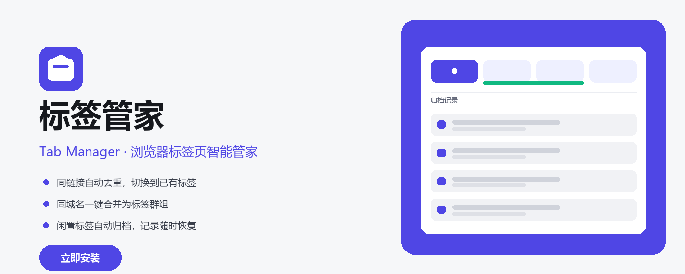

# 标签管家 · Tab Manager

一款免费、无广告、注重隐私的 Chrome 扩展，帮你把杂乱的浏览器标签收拾得井井有条——打开相同链接自动切换、同域名标签收成群组、长时间不看的标签自动归档，所有归档都能一键找回。
A free, ad-free, privacy-focused Chrome extension that brings order to your messy tabs — auto-switching to duplicates, grouping same-domain tabs, auto-archiving idle tabs, and recovering anything with one click.

> 完全免费 · 无广告 · 不收集任何用户数据
> Free · Ad-free · No personal data collected

## ✨ 功能特性 / Features

- **同链接去重**：再打开一个已经开着的网址时，自动跳到已有的标签，而不是叠出新标签。可在设置中选择「仅当前窗口」或「所有窗口」查找重复；还能用允许列表放行特定网址（如网银、邮箱等需要多开的后台页）。
  - *Duplicate tab detection*: When you open a URL that's already open, Tab Manager switches to the existing tab instead of creating a new one. Detect duplicates within the current window or across all windows, and use an allowlist to keep specific sites (e.g. banking, webmail) open multiple times.
- **合并同域名（标签群组）**：按「窗口 + 域名」把同站标签收进同一个 Chrome 标签群组，群组标题自动取品牌主体（如 `github`），不关闭任何标签、可视化整理。固定（pinned）标签不参与分组；一键「解组」即可拆回普通标签。
  - *Merge by domain (Tab Groups)*: Tabs from the same domain are grouped into one Chrome Tab Group per window, with a clean brand-based title (e.g. `github`) — no tabs closed, fully visual. Pinned tabs are excluded; one click to "ungroup" restores them to normal tabs.
- **自动归档闲置标签**：开启后每分钟巡检，超过设定时长（默认 30 分钟）没访问的标签会被关闭并记录，当前正在看的页面和受保护的固定标签除外。弹窗列表里每条还带进度条，距归档还剩多久一目了然（靛蓝 → 琥珀 → 红）。
  - *Auto-archive idle tabs*: Once enabled, Tab Manager checks every minute and closes tabs untouched longer than the set duration (default 30 min), recording them for recovery. The active tab and protected pinned tabs are spared. The popup shows a progress bar per tab (indigo → amber → red) so you always know how soon it archives.
- **手动归档 / 归档当前窗口**：随时把全部窗口或仅当前窗口的标签归档收起，固定标签按设置受保护，避免误关重要页面。
  - *Manual archive / archive current window*: Archive all windows or just the current one anytime. Pinned tabs are protected by setting, so important pages are never closed by accident.
- **归档记录与恢复**：所有归档按批次成组展示，支持单条或整批恢复、删除、清空，误关的页面随时找回。
  - *Archive history & recovery*: All archives are grouped by batch. Restore or delete individual items or whole batches, or clear all — recover any mistakenly closed page in seconds.
- **最常访问面板**：归档页顶部按网址出现频次列出高频站点，一眼直达，快速重开常用链接。
  - *Most-visited panel*: The archive page surfaces your most frequently archived URLs at the top, so you can reopen common links in one click.
- **多语言**：中文（默认）、English、日本語、한국어，设置内随时切换，界面实时刷新。
  - *Multilingual*: Chinese (default), English, 日本語, 한국어 — switch anytime in settings; the UI updates live.

## 🖼 商店素材 / Store Assets

宣传图存放于 [`promo/`](promo/) 目录，可直接用于 Chrome 网上应用店的商品详情页：

| 尺寸 Size | 用途 Purpose | 文件 File |
|---|---|---|
| 1400×560 | 商店横幅 Marquee | `promo/promo-marquee-1400x560.png` |
| 440×280 | 商店小图 Small tile | `promo/promo-small-440x280.png` |

## 📥 安装 / Installation

- **Chrome 网上应用店（推荐）**：[点击安装](https://chromewebstore.google.com/detail/%E6%A0%87%E7%AD%BE%E7%AE%A1%E5%AE%B6-tab-manager/ajkeahkmholfkmbfnjenpdaojnhemhii)
  - *Chrome Web Store (recommended)*: [Install here](https://chromewebstore.google.com/detail/%E6%A0%87%E7%AD%BE%E7%AE%A1%E5%AE%B6-tab-manager/ajkeahkmholfkmbfnjenpdaojnhemhii)
- **开发者模式加载**：克隆本仓库后，在 `chrome://extensions/` 开启开发者模式 → 「加载已解压的扩展程序」→ 选择 `tab-manager/` 目录。
  - *Load unpacked*: After cloning, open `chrome://extensions/`, enable Developer mode → "Load unpacked" → select the `tab-manager/` folder.

## 🔒 隐私 / Privacy

本扩展不读取、不上传任何浏览内容或个人数据，所有设置与归档仅保存在你本地浏览器。完整说明见 [隐私政策](privacy-policy.html)。
This extension reads and uploads no browsing content or personal data; all settings and archives are stored only in your local browser. See the [Privacy Policy](privacy-policy.html) for details.

## 💬 联系与反馈 / Contact & Feedback

- 邮箱 / Email：<wyh452107393@gmail.com>
- GitHub Issues：遇到问题或想提建议，欢迎到 [Issues](https://github.com/xuanzhenzi-w/web-tab/issues) 反馈，我会尽快回复。
  - *GitHub Issues*: Found a bug or have a suggestion? Open an [Issue](https://github.com/xuanzhenzi-w/web-tab/issues) — I'll reply as soon as I can.

## ☕ 支持作者 · 爱发电 / Support the Author · Afdian

如果你喜欢「标签页管家」这款 Chrome 扩展，欢迎通过爱发电支持我继续独立开发与维护：
If you enjoy the Tab Manager extension, consider supporting my independent development via Afdian:

**爱发电主页 / Afdian：https://afdian.com/a/xuanzhengzi**

你的每一份支持，都是对开源小工具最实在的鼓励。本扩展完全免费、无广告、不收集任何隐私数据，捐赠纯属自愿，不影响任何功能。
Every bit of support is the most practical encouragement for this open-source tool. The extension is completely free, ad-free, and collects no data — donations are entirely voluntary and never affect any feature.
